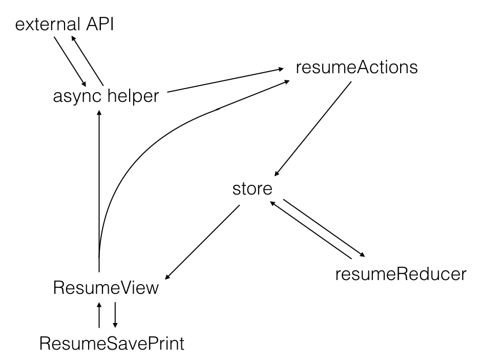
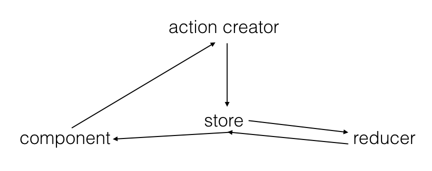

Routing in Redux can be confusing at first. But once learned, it makes it quite easy to follow data flow throughout the app. We'll trace a few routes in this document to illuminate general concepts.

Let's trace what happens when a user searches for a word using our Thesaurus feature:
* User enters word into a TextField (a Material-ui component), which lives at the bottom of `src/components/ResumeSavePrint`.
* onBlur, the passed-down method `handleUpdateLocalState` is called, which updates the client state with the TextField input. This method lives in the parent component, `src/views/ResumeView`, and is passed down explicitly via props in the `render` method of `ResumeView`.
* User clicks the associated FlatButton (another Material-ui component), which triggers the `handleThesaurus` method within `ResumeSavePrint`.
* `handleThesaurus` takes the word from `state.resumeState.thesaurusQuery`, and calls two actions on it: `wordSearch` and `getThesaurusResultsAsync`.
    - These actions were passed down via props from the parent component, `ResumeView`.
    - They were imported from `src/actions/resumeActions` and added to the `ActionCreators` object, which was passed into `mapDispatchToProps` and bound to `dispatch` via the `connect` call at the bottom of the file.
    - They were then passed down with the rest of `ResumeView`'s props with using `...props` in the `render` method of `ResumeView`.
* `resumeActions` is a collection of action creators. These functions take a payload and format in a standardized way, returning an object with a `type` and a `payload`, and nothing more.
    - The `type` is a constant, which are defined in `src/constants`.
* Because they were bound to `dispatch`, when the actions are called, they are automatically dispatched to the store (`src/store/configureStore`). The store passes the actions along to the reducers, which live in `src/reducers`.
* The action is first caught in `reducers/index`, which combines the individual reducers. The relevant reducer for these actions is `resumeReducer`.
* `resumeReducer` routes the actions by `type`. Let's explore the `WORD_SEARCH` action first, as it's more straightforward.
    - A pure reducer function handles the action. This function accepts the current state and a payload, and returns a new, updated state. The previous state is never mutated, allowing for easy time-travel debugging. And the function is pure, so a given input will *always* yield the same output.
    - This particular function searches through the bullet text of the resume, and returns a copy of the state with the updated `wordCount` property.
    - This returns state back to the store, add views update accordingly.
* Note that although it lives in the same file with action creators, `getThesaurusResultsAsync` doesn't follow the standard action creator format. To keep the action creator functions pure, API calls are moved into separate functions which then call action creators. When the asynchronous call comes back, `getThesaurusResultsAsync` dispatches the action `updateThesaurusResults` with the results as payload.
    - This action is again caught in the `resumeReducer`, where the handling function modifies the payload and returns an updated copy of the state.
    - Again, this updated state is returned to the store, and views update accordingly.

This diagram shows our specific use:

And this is a more generalized, simplified version:

